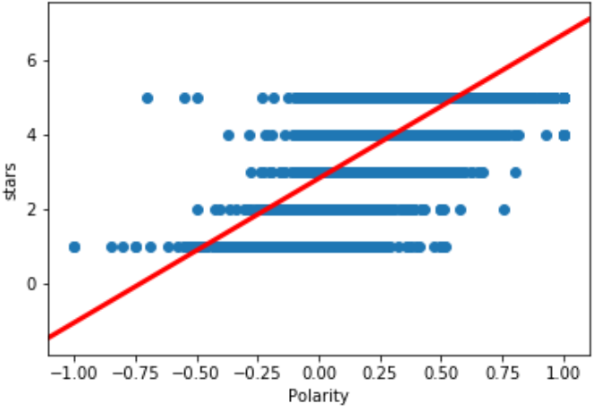
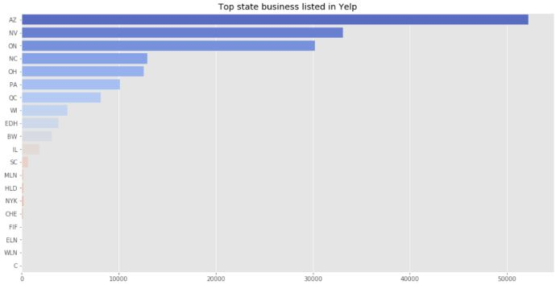
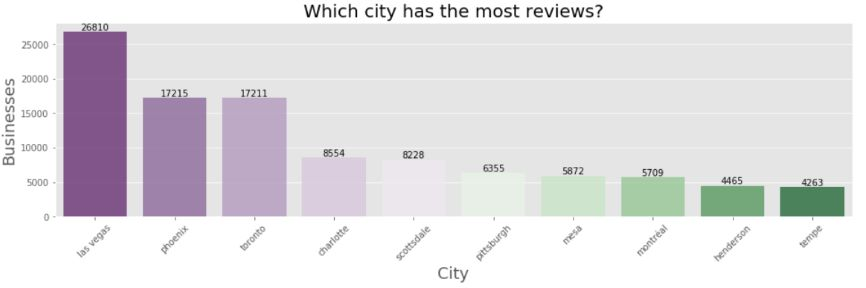
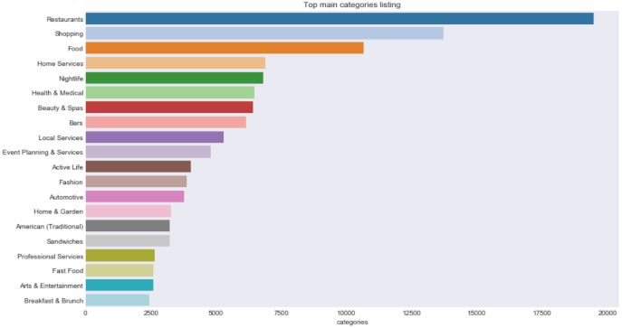
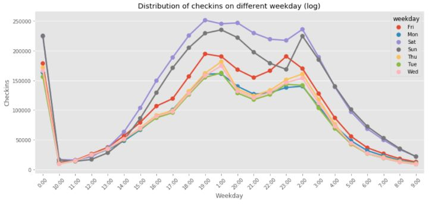
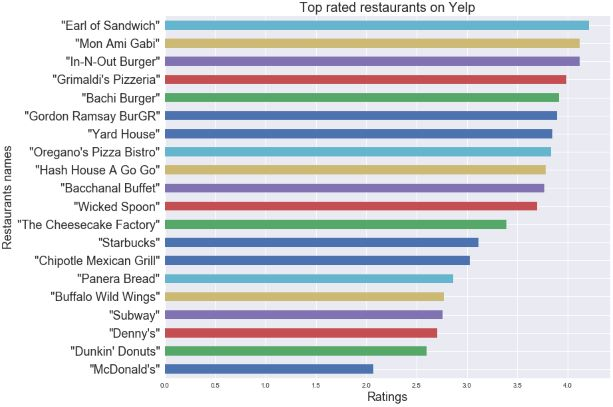
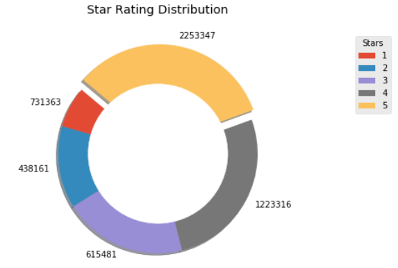
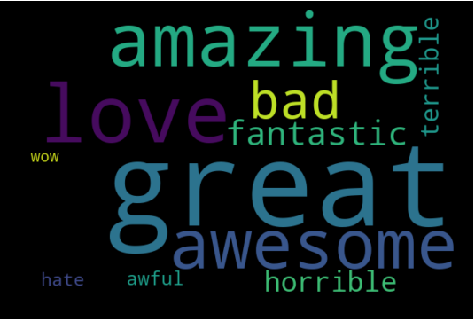

# Data analysis Of Yelp reviews :hand: fa18-523-65, fa18-523-67

| Prajakta Patil, Sahithya Sridhar 
| patilpr@iu.edu, sahsrid@iu.edu
| Indiana University, Bloomington
| hid: fa18-523-65, fa18-523-67
| github: [:cloud:](https://github.com/cloudmesh-community/fa18-523-65/blob/master/project-report/report.md)

:o: please fix format, figure labels must not have spaces, repeatedly mentioned.

---

Keywords: Yelp, Natural language processing (NLP), Sentiment analysis, Scikit-learn

---

## Abstract

Yelp is quite a useful platform to read and upload reviews for businesses
like restaurants. The main objective of our work is to perform analysis on
text reviews to find how well they correlate with star ratings given by 
users to restaurants. It is found that star ratings 1 and 5 are well 
correlated with textual reviews unlike ratings 2, 3 and 4. Our analysis
can help users make better decisions by suggesting them to either look at
star ratings or go through actual text reviews [@fa18-523-65-www-1].

## Introduction

Users visit Yelp to either look for a restaurant or write a review for one
after their visit. Yelp had 148 million reviews on its website at the end 
of 2017. These reviews are in both text and star rating formats. Users also
post pictures of food and the restaurant which in turn is used for making 
decisions. This is also useful for businesses to improve their services.
When a restaurant is very popular, it tends to have lot of reviews and in
general, a higher star rating. In such cases, people are drawn to choose 
that restaurant if it fits their choice of cuisine, budget and other 
parameters they might have in mind. However, when there are multiple 
restaurants that are similar, it becomes little difficult to pick one. We 
took a dataset of Yelp reviews and tried to find correlations between text
reviews and star ratings. We performed additional analysis to show additional
patterns in data. The technologies used to perform this analysis is Natural
Language Processing and Sentiment Analysis [@fa18-523-65-www-1].

## Literature review

Li et al [@fa18-523-65-www-5] performed text analysis on Yelp reviews to 
study if they can be categorized as *Useful*. This analysis was needed for 
businesses that didn’t have many reviews and hence no reviews were 
categorized as either *Useful /funny/cool*. The researchers used SVM and 
Random Forest models to perform this analysis. They extracted features such
as the number of words, sentences, average sentence length, TFIDF, star 
rating, sentiment of the review as either positive or negative, number of 
votes received by a review, how long has the user been providing Yelp 
reviews etc. Using SVM, the researchers were able to achieve an accuracy
of 0.67 and 0.69 in the case of Random Forest model for predicting if a
review is Useful [@fa18-523-65-www-5].

Hajas et al [@fa18-523-65-www-4] tried to understand how external factors
such as how changing tastes result in a cyclic behavior for user reviews
for restaurants. They took Yelp reviews from 11 college campuses across USA
and modeled restaurant ratings as a function of restaurant quality using a
second-degree liner differential function. They were able to show a cyclical
behavior in a restaurant’s rating based on its quality - restaurants that 
initially started out with good quality dropped their investment in maintaining
it which resulted in bad reviews. This in turn forced them to invest again in
quality to win back lost business [@fa18-523-65-www-4]. 

> "We provide heat maps of where most reviewed restaurants are located. The aim
> of this is to show that most reviewed restaurants are usually clustered together.
> This is an intuitive result, given that consumers have the option of choosing
> another (equally good) restaurant if the originally chosen restaurant is crowded
> [@fa18-523-65-www-4]". 

Koven et al [@fa18-523-65-www-7] focused on methods to predict useful reviews. 
Their motivation was that there is lot of work done in trying to find bad/fake
reviews. But, it was useful to find genuine and useful reviews. They created 
various attributes for Yelp reviews such as reviewer’s average star rating, 
relationship between reviewers, topic and personality analysis, geographic 
distribution of reviews etc. They used the J48 algorithm and reached an accuracy
of 79.8% in predicting if a review is useful or not. They were also able to 
predict bad reviews with roughly 5% false positives [@fa18-523-65-www-7].

## Dataset

The dataset used for analysis is taken from Kaggle website. This data contains
about 5.2 million user reviews for 174k businesses from 11 metropolitan areas.
The data is in CSV and JSON format. It has the following features business_id,
name, neighborhood, address, city, state, postal_code, latitude, longitude, stars,
review_count, attributes, categories about businesses across 11 metropolitan areas
in four countries. It was originally put together for the Yelp Dataset Challenge 
to perform analysis on Yelp's data [@fa18-523-65-www-1].

## Data processing

The data is processed to get it ready for analysis. Using the NLTK library, we
removed the stop-words and the punctuations. All the words were converted to 
lowercase. We also removed unnecessary symbols and spaces. We didn’t remove 
numbers as it might help users with the prices which is an important factor 
while choosing a restaurant. All these operations helped reduce the size of 
the data while retaining useful information [@fa18-523-65-www-1].

## Analysis methods

Following methods are used for analysis to make observations and conclusions from 
data:

*	Linear Regression is performed to find out if there is any correlation 
between reviews and ratings (stars). The reviews were characterized into
polarity. This is done using the python library called *TextBlob*. The polarity
value is between -1 to 1. Polarity above 0 means the text emotion is positive
while polarity below 0 means the text emotions are negative. 0 polarity means 
neutral emotions. We also calculated another parameter called *Subjectivity*. 
Subjectivity reflects the user’s personal emotions and opinions. Subjectivity
is between 0 to 1. A subjectivity of 0 means it’s a fact-based opinion and 1 
means it’s a subjective opinion. We also used this method to find out if there
are correlations between reviews and classification of the review i.e. whether 
it is categorized as *useful, cool or funny*. As the data we worked with was large,
we used a sampling method to use only 10% of all the data for this analysis.
* Logistic Regression, Multinomial Naïve Bayes and Random Forest algorithms are
used to predict the rating based on text reviews. This will help understand and
predict how well the text review and ratings match. Low accuracy means that there 
is more to the ratings that just the text review. High accuracy means that the 
ratings accurately capture the sentiments in the text review. 
*	Count, Term Frequency Inverse Document Frequency (tfidf) vectorizer, and Linear
SVC help with understanding which words are most commonly used in reviews for a 
restaurant and help in gaining insight on why certain places might be famous or 
infamous for.
 
## Results

Linear regression analysis between polarity and star ratings showed a correlation 
coefficient of 0.61. This means that emotions in the review and star ratings are 
moderately correlated. 
This is shown in +@fig:correlation-between-star-rating-and-polarity. We can see
that the regression line graphically represents this correlation between review
text and star rating given by user. One important result is that we got p value
less than 0.001 which means that the results are highly significant and that they
are very unlikely to have occurred by chance. Review classifications such as useful,
cool and funny has negative correlation with review emotions. This is likely because
people might have used ironic language while providing a review for the business. 
All results from the linear regression analysis are shown in Table.1 

{#fig:correlation-between-star-rating-and-polarity}

**Table.1 Correlation between review sentiment and star rating and review class**

| Polarity (Review Sentiment)| Correlation coefficient-r value | p value |               
|----------------------------|---------------------------------|---------| 
| Star Rating                |  0.61                           | < 0.001 |
| Useful                     | -0.064                          | < 0.001 |  
| Funny                      | -0.043                          | 3.97    |
| Cool                       | -0.011                          | 3.66    |
  
We have used Logistic Regression, Multinomial Naïve Bayes and Random Forest models
to check for accuracy in classifying reviews into star-ratings from 1 to 5. Count
vectorizer was used to encode data features in a matrix in which these algorithms
can learn using scikit-learn. We trained all the models on the data set and checked
their performance for guessing the rank on the test data. We achieved a highest overall
precision of 0.55 with Logistic Regression. All 3 models had higher precision when 
predicting 1 and 5-star ratings and lowest precision when predicting star rating 3 in
general.

**Table.2 Logistic Regression**

| Star Rating | Precision | Recall  | F1-Score |               
|-------------|-----------|---------|----------| 
| 1           | 0.78      | 0.72    | 0.75     |
| 3           | 0.60      | 0.43    | 0.50     |
| 5           | 0.87      | 0.94    | 0.90     |
| Average     | 0.55      | 0.82    | 0.81     |

**Table.3 Multinomial Naïve Bayes**

| Star Rating | Precision | Recall  | F1-Score |               
|-------------|-----------|---------|----------| 
| 1           | 0.71      | 0.74    | 0.73     |
| 3           | 0.56      | 0.34    | 0.42     |
| 5           | 0.85      | 0.93    | 0.89     |
| Average     | 0.78      | 0.80    | 0.78     |

**Table.4 Random Forest**

| Star Rating | Precision | Recall  | F1-Score |               
|-------------|-----------|---------|----------| 
| 1           | 0.70      | 0.60    | 0.65     |
| 3           | 0.46      | 0.16    | 0.23     |
| 5           | 0.78      | 0.94    | 0.86     |
| Average     | 0.72      | 0.75    | 0.72     |

We created a confusion matrix to understand these correlations in simpler way.
We grouped our data by star rating. Confusion matrix thus created is shown in
form of heatmap in +@fig:confusion-matrix-for-predicting-emotions. We can see 
that *useful* and *funny* is correlated with text length. *cool* and 
*subjectivity* are correlated to polarity.

{#fig:confusion-matrix-for-predicting-emotions}

We wanted to understand patterns from this data. First, we looked at reviews by
states. Shown in +@fig:top-states-for-businesses-in-Yelp-data, we see Arizona is 
the state with most reviews for businesses followed by Nevada and California. We 
then looked at number of reviews by cities. As seen in +@fig:top-cities-with-most-user-reviews, 
Las Vegas is the city with most number of reviews with 26810 
reviews followed by Phoenix and Toronto. +@fig:top-cities-with-most-user-reviews 
shows only top 10 cities but, our dataset has reviews for 11 metropolitan areas 
and had reviews for 1093 cities. We also looked at what type of businesses are 
present on Yelp. In +@fig:categories-of-businesses-in-Yelp-data we can see that 
various types of restaurants receive most reviews followed by shopping and home 
services. Another interesting observation we wanted to make was which weekday was 
preferred by users to go out and hence provide reviews for these businesses. 
+@fig:distribution-of-Checkins-for-weekdays shows that most users liked to go 
out on Saturday followed by Sunday and Friday. Monday and Tuesday saw the lowest 
number of checkins for businesses.

{#fig:top-states-for-businesses-in-Yelp-data}

{#fig:top-cities-with-most-user-reviews}

{#fig:categories-of-businesses-in-Yelp-data}

{#fig:distribution-of-Checkins-for-weekdays}

We used pandas *groupby* function to calculate mean star ratings for businesses.
For purpose of this project we decided to look at details of restaurants only. 
+@fig:top-rated-restaurants-on-Yelp shows top rated restaurants with descending 
average descending star rating. We are showing top 10 businesses only as data 
has more than 1000 places. *Earl of Sandwich* was top rated restaurant with 
average rating of 4.25. Top 10 places are dominated by restaurants that serve 
pizza and burger. One other thing to notice is that most of these restaurants 
are franchises. However, regional franchises have higher star ratings than ones 
that have pan US presence.

{#fig:top-rated-restaurants-on-Yelp}

+@fig:distribution-of-Star-ratings shows distribution of ratings offered to 
businesses. We see that rating 5 was most used rating by reviewers for 
describing their experience at given restaurant whereas the rating 2 was 
the least. Looking at distribution of review length for each star rating shows 
there was no significant difference in review length distribution. 
However, comparing +@fig:review-length-distribution-by-Star-rating with 
+@fig:distribution-of-Star-ratings shows same trend. Meaning more restaurants got
5-star rating but they also got some textual review. We also looked average number 
of reviews given by users. We can see in +@fig:distribution-of-number-of-reviews-by-users 
that most users provided less than 5 reviews. There is small percentage 
of users who have provided more than 30 reviews.

{#fig:distribution-of-Star-ratings}

{#fig:review-length-distribution-by-Star-rating}

{#fig:distribution-of-number-of-reviews-by-users}

We were interested in seeing usage of words to describe user experience about a 
certain place. We chose 11 words that we thought could have been most used in 
reviews. This list covered words that help express both positive and negative 
emotions. +@fig:most-commonly-used-words-for-good-and-bad-reviews shows that word
*great* was used a lot by users to describe positive experience. Word *bad* was
used mostly to describe negative experience.

{#fig:most-commonly-used-words-for-good-and-bad-reviews}

## Discussion

We observed a higher accuracy in predicting the star rating of 1 and 5 than all
other ratings i.e. 2, 3 and 4. We think that this limitation is a result of 
understanding user emotions and applying language models to decode it. It is
difficult to find how many users write a very objective review and give star 
ratings accordingly. It is possible that someone has either a better or worse
than expected experience and provides a review based purely on emotions at that
point of time. Additional analysis is needed to understand how a person from a
certain cultural background finds food from other cultures appealing or not.

## Conclusions

We have been able to show how textual reviews and star ratings are generally 
moderately correlated. While choosing a restaurant, a user can rely more on star
rating 4 to find a good place and a star rating 1 to know that a certain place is bad.
If the restaurant has a star rating of 2 or 3, they will have to spend more time in
reading the actual textual reviews to make their decision. A good business has in 
general a lot more reviews than a bad one. Most users give very few reviews and they
do so more in case if their experience was good. Businesses serving pizzas and burgers
are one of the most liked places.

## Project members and Work Breakdown

* Prajakta Patil - fa18-523-65: Introduction, Literature review, Dataset, Data Analysis 
using Python, Results, Discussion
* Sahithya Sridhar- fa18-523-67: Abstract, Data processing, Analysis methods, Data 
Analysis using Python, Discussion, Conclusions

